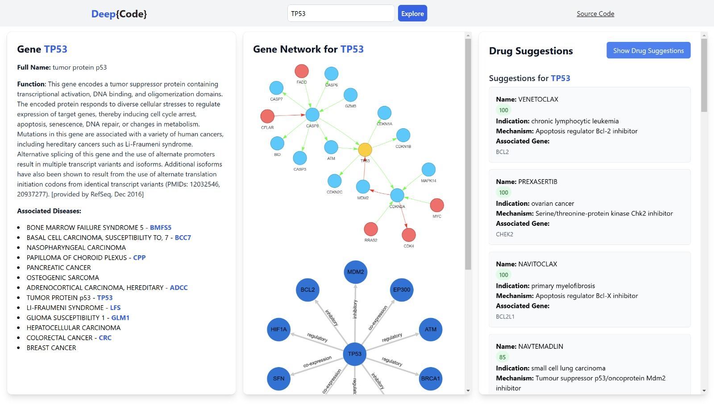
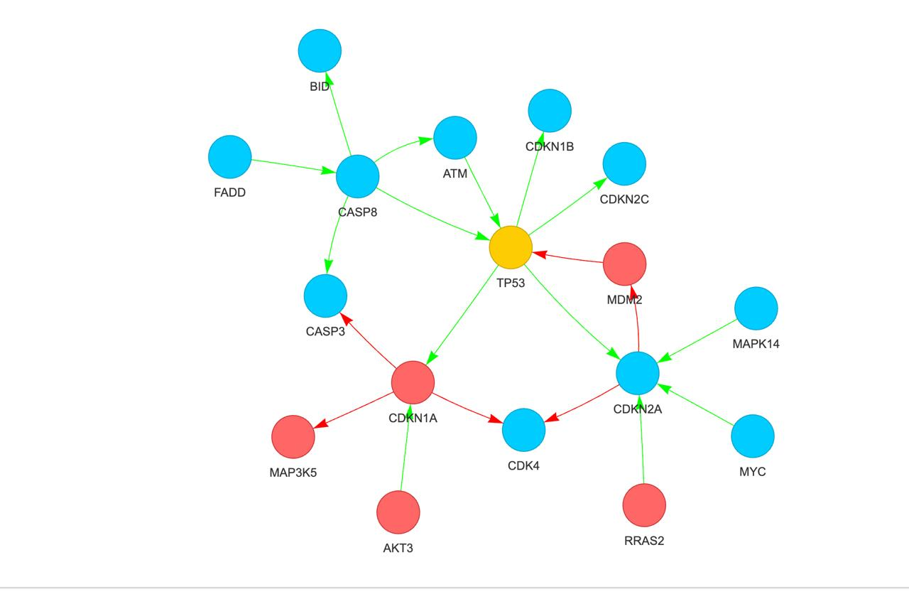
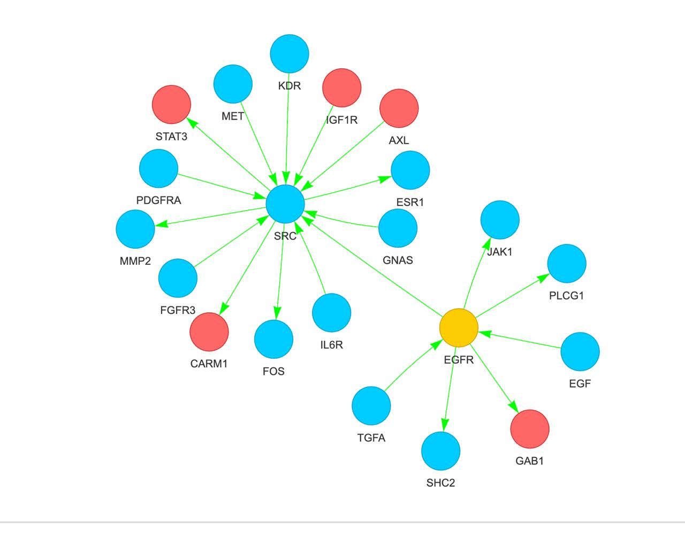
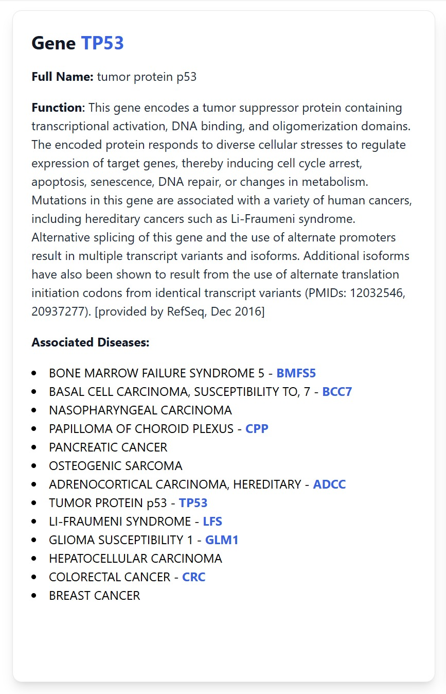
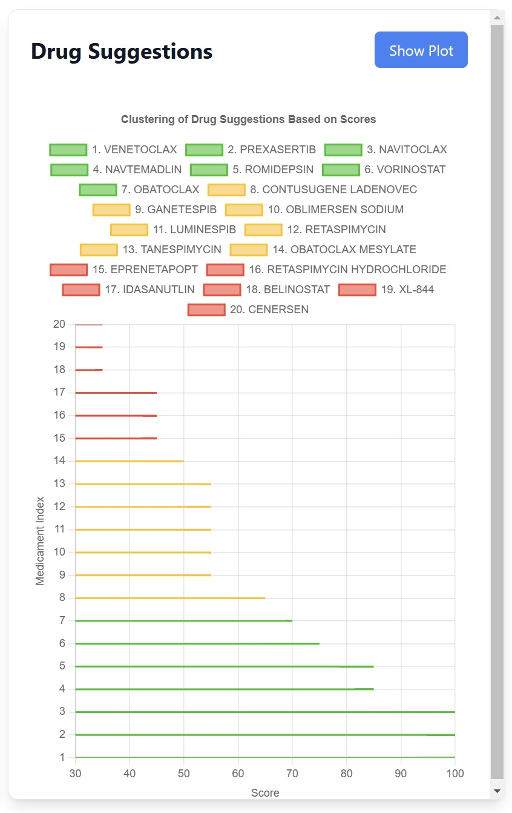

# DeepCode

## Overview

A cross-platform desktop application for visualizing gene interactions and exploring biological networks.

This tool combines Python-based bioinformatics processing (using Bio.KEGG and an NNLP model for gene association) with a React + Electron frontend, providing an interactive UI for gene discovery and exploration. The application fetches gene data, builds interaction graphs, and allows users to analyze biological functions and disease associations.

1. **Install dependencies**

  ```sh
    npm install --legacy-peer-deps
  ```

2. **Make env for python**

  ```sh
    python3 -m venv .venv
    source .venv/bin/activate      # Unix/macOS
    .venv\Scripts\activate.bat     # Windows
    pip install requirements.txt
  ```

3. **How to run defined in the package.json/scripts**

  ```sh
    npm start  
  ```

### Technologies Used

- **Backend:** python with Bio.KEGG for data fetching and NNLP (Neural Natural Language Processing) model for gene association using their summaries.
- **Frontend:** React Native + Electron for cross-platform desktop application and webpack for module bundling.
- **Visualization:** Cytoscape.js for gene interaction graphs

### Project Structure

- src/components **React Components**
- scripts/  **Backend for live-data and graph generation**
- public/  **Static/preload/electron files**

# Preview



### Gene TP53 using Bio.KEGG



### Gene EGFR using Bio.KEGG



### Gene Info Overview



### Clustering of Drug suggestions based on score


